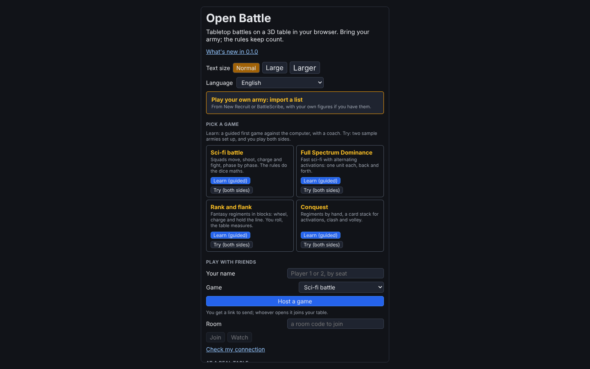
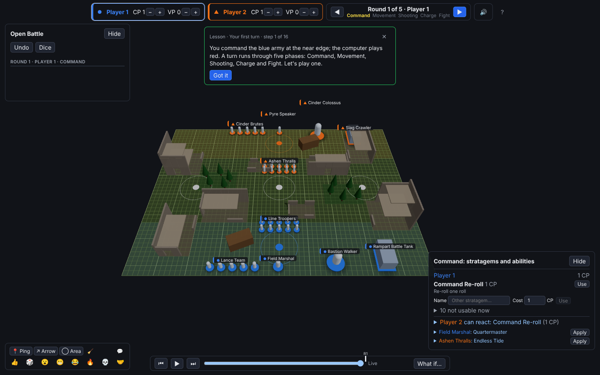
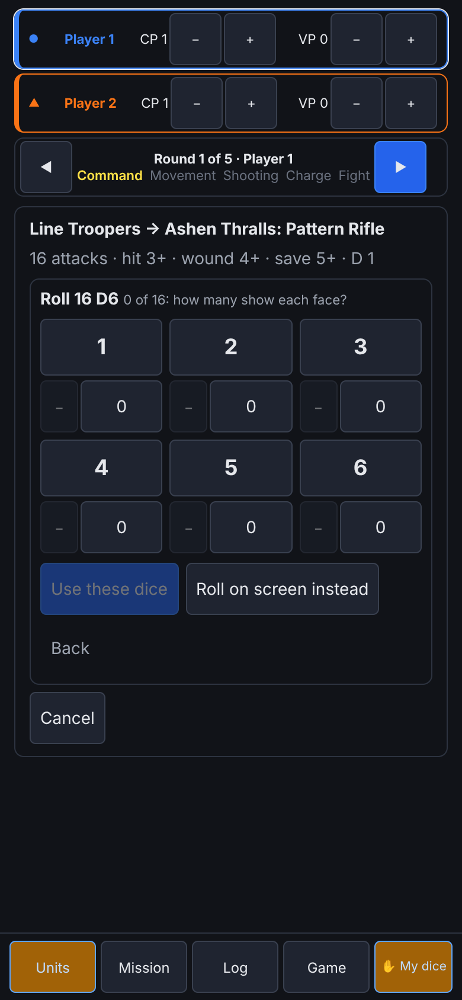
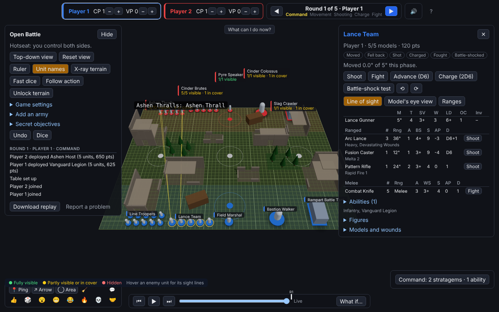
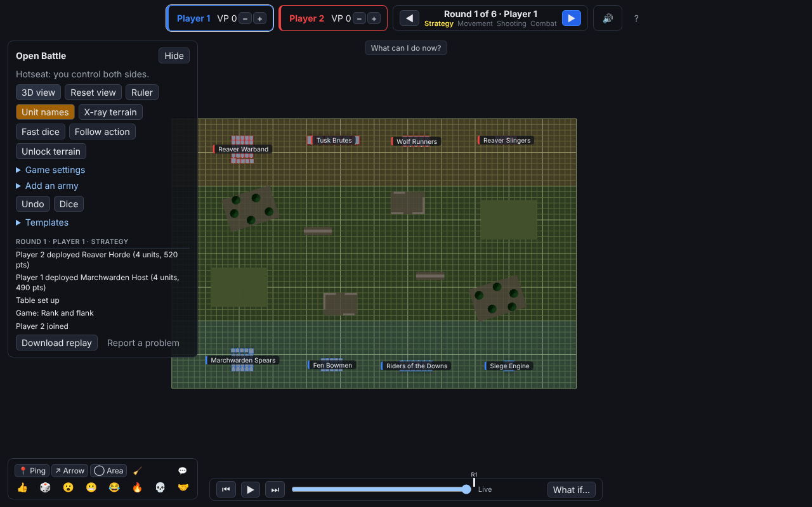
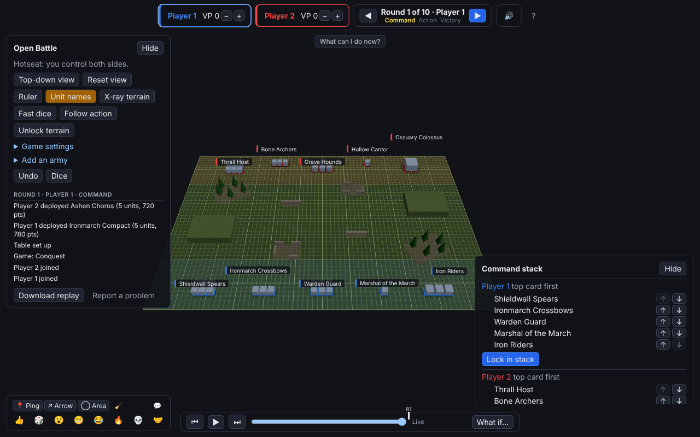

# Open Battle

An open source, browser-based, peer-to-peer tabletop for miniatures wargames. Think Tabletop Simulator, but built for wargaming: inch-based measuring, bases with facing, units and regiments, dice and phases.

Players need only a browser. One player hosts, shares a link, and the browsers talk to each other directly over WebRTC; a server just hands out the app and introduces the players.

> Open Battle is an independent project and is not affiliated with or endorsed by any game publisher. Warhammer 40,000, Warhammer: The Old World and related names are trademarks of Games Workshop Ltd. This repository ships no publisher artwork, models, unit data or rules text. Players bring their own armies, and the sample armies in the app are made up.



## What it does

- **Four game systems built in.** A squad-based sci-fi battle game in phases, a rank-and-flank fantasy game with regiment blocks, Conquest-style regiments with a secret command stack, and Full Spectrum Dominance with activation dice. Each has an invented sample army and a one-click demo.
- **A 3D table with a top-down view.** Drag units to move them with live distance, coherency and engagement range. Ranked blocks wheel, reform, turn and march. Switch to an orthographic top-down view for precise measuring.
- **True and abstract line of sight.** Lines are traced from each model's eyes against terrain and other models, or, for games that use them, stand-in heights or flat footprints. Cover, hidden units and higher ground come from the same check, and you can look through any model's eyes.
- **A terrain editor.** Ruins, woods, containers, hills and more, with floors models can stand on. Save and load layouts, and upload your own terrain models.
- **Your own figures.** Import an army list from BattleScribe or New Recruit, then drop a 3D model file (`.glb`, `.gltf`, `.stl`, `.obj`, `.ply`) onto a unit. Everyone in the game sees it.
- **Attack automation and a dice tray.** Pick a weapon and a target, and the attack panel works out who is in range and what to roll. Every number can be changed before the dice are thrown. Dice land in a tray, and the big rolls get their moment.
- **Missions and secret objectives.** Pick a mission at setup. The app suggests each side's score and a player confirms it. Secret objectives and hidden orders stay on their owner's device until revealed, and every player can check they weren't changed.
- **Replays and "What if".** The whole game is a log, so you can scrub back through it, download it as a replay file, or branch a new game from any moment to try another move.
- **Online, 1v1 or 2v2.** Host a room and send the link. Others can join, watch, or take over as host if the host drops. Teams of two share CP and VP.
- **Table talk and voice.** Pings, arrows, areas, chat and reactions on the table, plus push-to-talk or open-mic voice over the same peer connections.
- **Broadcast view.** A stream view with a commentator's camera, a spectator delay, and end-of-game moment cards.
- **Rules packages.** Players can load sandboxed rules packages that add rules to a game, or a whole new game, shared peer to peer and checked by hash.
- **Rules are advisory.** The app measures, rolls and reminds, but never blocks a move. Every wound, status and score can be edited, and Undo takes back your last action.
- **Table companion.** Playing with real models on a real table? Open the companion on a phone (one for both of you, or one each). It keeps the turn, the wounds and the score, takes the dice you roll by hand, and asks what it can't see, such as how many models are in range.
- **Learn to play.** A guided first game for each system against the computer, with a coach saying what to do next.
- **Campaigns, events and play by mail.** A shared campaign book with a league table, map and unit stories; chess clocks and Swiss rounds for event nights; and games that last for days through signed turn files.
- **Annotated replays.** Notes and marks on moments, chapters, and review rooms where a coach leads and others follow.
- **For everyone.** German and French translations, keyboard play, text size, colour-blind side colours with shapes, and a screen-reader announcer.
- **Built to be tested.** A soak bot plays hundreds of seeded games every night, with dropped players and host changes thrown in, and the in-app **Report a problem** button downloads a replay of the game with the errors that went with it.











## How to play

<!-- Play now: a public hosted copy will be linked here once there is one. -->

There is no public hosted copy yet. To play, someone in your group runs it, in one of two ways:

- **Host it for your group** on any server or home machine with Docker: `cp .env.example .env`, fill it in, and `docker compose up -d`. Everyone then just opens your address in a browser. See [docs/self-host.md](docs/self-host.md).
- **Run it on your own computer** with Node, as below. That's enough to try the demos, or to play a friend over the internet through public relays.

Once opened, the app keeps itself on the device and can be installed (the browser's "Install" or "Add to Home Screen"). With no network, games on one screen, games against the computer, lessons, replays, saved armies and tables, and campaign books all still work. A new version is offered on the start page, never in the middle of a game.

## Getting started

Requires Node 22+ and [pnpm](https://pnpm.io) (`corepack enable` will provide it).

```sh
pnpm install
pnpm dev          # http://localhost:5173
```

Click one of the **Try it now** cards to play both sides of a demo game on one screen. To play a friend, choose a game, press **Host a game** and send them the link. **Check my connection** on the landing page tells you whether your network is likely to need a TURN server.

| Command             | What it does                                           |
| ------------------- | ------------------------------------------------------ |
| `pnpm dev`          | Dev server with hot reload                             |
| `pnpm test`         | Unit tests (Vitest)                                    |
| `pnpm soak`         | Seeded bot games for every system (also run in CI)     |
| `pnpm typecheck`    | TypeScript, strict (`tsc -b`)                          |
| `pnpm lint`         | ESLint                                                 |
| `pnpm format`       | Prettier                                               |
| `pnpm build`        | Production build into `dist/` (static)                 |
| `pnpm preview`      | Serve the production build                             |
| `pnpm relay`        | Self-hosted signalling relay                           |
| `pnpm perf`         | Rendering benchmark with sample armies                 |
| `pnpm perf:load`    | Landing page load benchmark on a throttled network     |
| `pnpm soak:browser` | The soak bot in two real browser tabs, for leak checks |
| `pnpm smoke`        | Browser smoke tests through each way into the app      |

## Hosting your own

The app is a static site. Every push to `main` builds it to the `gh-pages` branch: set the repository's **Settings → Pages → Source** to "Deploy from a branch" and pick `gh-pages`. Browsers find each other through public Nostr relays by default.

For a full self-hosted stack, with the app, your own signalling relay and a TURN server for players behind strict networks, run `docker compose up`. See [docs/self-host.md](docs/self-host.md).

## How it works

- **The game is an event log.** Players send intents. The host turns each one into a numbered, fully resolved event (this is where dice are rolled) and every peer applies the same events in the same order. Live sync, undo, late joining, spectating, replays and branching all come from that one log, and if the host leaves another player takes over.
- **Game modules are code.** Each game is a typed TypeScript module: its rules as data (characteristics, dice, turn structure, keyword rules, attack procedures) plus code for what data can't say well (combat sequences, reactions, command stacks). See [docs/system-modules.md](docs/system-modules.md), and [docs/packages.md](docs/packages.md) for rules packages loaded at runtime.
- **Units and bases.** One world unit is one inch. Base sizes are kept in millimetres, as they are printed, and can be round, oval or rectangular, with a facing.

| Concern      | Choice                                                                                                                |
| ------------ | --------------------------------------------------------------------------------------------------------------------- |
| 3D rendering | [three.js](https://threejs.org) via [React Three Fiber](https://r3f.docs.pmnd.rs) + [drei](https://drei.docs.pmnd.rs) |
| UI           | React 19                                                                                                              |
| State        | [Zustand](https://zustand.docs.pmnd.rs) holding a pure, serialisable game state                                       |
| Networking   | WebRTC data and audio via [Trystero](https://github.com/dmotz/trystero) (Nostr or a WebSocket relay for signalling)   |
| Build / test | Vite, Vitest, TypeScript, ESLint, Prettier                                                                            |

## Releases

What changed in each version is in [CHANGELOG.md](CHANGELOG.md), and the start page's **What's new** shows the highlights. Pushing a `v*` tag, or running the Release workflow by hand with a version, publishes a GitHub release with that version's notes.

## Contributing

Bug reports, ideas and code are all welcome. [CONTRIBUTING.md](CONTRIBUTING.md) covers setup, the checks to run before you push, how the code is laid out and how to report a bug with a problem report file.

## License

[MIT](./LICENSE)
