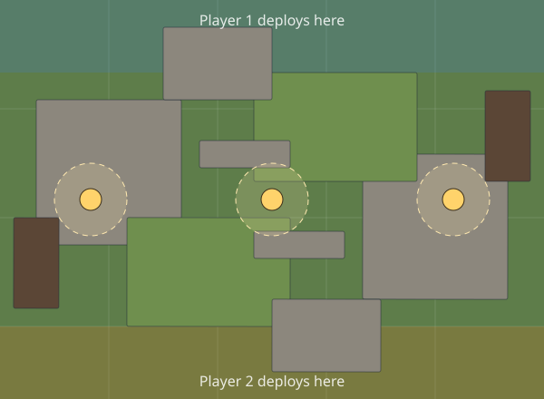

<!-- Made by `pnpm rulebook` from the brinewatch module (version 1.0.0). Don't edit by hand. -->

# Brinewatch: the rules

A skirmish game for two players, about an hour long, played with a crew of five to ten models each. At low tide the drowned harbour town of Brinewatch comes up out of the sea, and three crews climb its broken towers for what the water left.

## What you need

A table 30" x 22", a tape measure in inches, a handful of six-sided dice, and a crew each: your own models or the print-and-play stand-ins. Put plenty of terrain on the table, some of it tall: ruins with upper floors, reed beds (a fluffy cloth will do) and a couple of hulks (boxes).

On a screen, Open Battle measures, rolls and keeps every rule. At a real table it keeps the score: open it on a phone and pick **At a real table**.

## Rounds and goes

The game lasts **4 rounds**. Each model is its own unit. In each round players take turns giving one **ready** model its **go**, starting with the player who goes first, until every model is **expended**. Then all are ready again.

- A model's go has **2 action points** (AP). Spend them on the actions below, in any order and mix. Its go ends when they are spent, or when its player ends it.
- When one player has no ready models left, the other gives theirs their goes in turn.
- A model can't be activated twice in a round.

## Actions

1. **Move (1 AP):** up to its Move in inches. Climbing up or down counts: a floor is 3" up. A second Move costs another point. Hulks can't be walked through.
2. **Shoot (1 AP):** at an enemy it can see within its Range, if no enemy is within 1" of it. Once a go.
3. **Fight (1 AP):** an enemy within 1". Once a go.
4. **Stand guard (1 AP):** it watches; this ends its go, whatever it has left.
5. **Emerge (1 AP):** a hidden Lurker comes out of its hideout.

## Shooting

Roll the shooter's **Shoot** dice. Each die that rolls its **Hits on** number or higher hits. The target rolls a die for each hit; each that rolls its **Saves on** number or higher saves it. Each hit not saved takes a wound; a model with no wounds left is **out of action**.

- **Cover:** a target in or behind a ruin or reed bed, from the shooter's view, saves on one less (a 4+ save becomes 3+).
- **Obscured:** a shot through a reed bed neither model stands in needs one more to hit.
- **Vantage:** a shooter standing 2" or more higher than its target (up a floor) takes its cover away. A model with **Long Eye** also hits on one less with vantage.

## Fighting

The attacker rolls its **Fight** dice and hits and wounds as when shooting (no cover in a fight). If the target is still standing, it strikes back the same way.

## Standing guard

A model on guard watches until it fires or the round ends. The first time an enemy model **ends a move**, **emerges**, or **goes to shoot or fight** where the guard can see it and has it in Range (and no enemy is within 1" of the guard), the guard fires at it at once, before that enemy's shot or blow: a **snap shot** that needs one more to hit. Then it is off guard.

## Hidden lurkers

Each crew has a **Lurker**. As the first round starts, the Lurkers are set aside, and each player secretly picks one of their three **hideouts** for each of their Lurkers: west, middle or east, 4.5" ahead of their deployment strip. Write it down; Open Battle keeps the choice sealed on your device.

- A hidden Lurker's go can be spent hiding (end it at once), or on **Emerge**: reveal the hideout and set it up there, then spend its other point.
- Any Lurker still hidden when round 3 begins emerges then, without spending a go.

## Holding a marker

A side **holds** a marker when it has more models within 2" of it than the other side (the bells: within 3" and standing 2" or more up). Nobody holds it on a tie. The side with more victory points after round 4 wins.

## The campaign

Play the three missions in order with the same crews, and keep a campaign book (Open Battle's **Campaign** keeps it for you). After each game:

- **Experience:** each model gets 1 for coming through and 1 for each enemy it took out (2 at most).
- **Honours:** at 3 and at 6 experience, roll a D3: 1 **Keen Eye** (hits on one less shooting), 2 **Brawler** (+1 Fight), 3 **Fleet** (+1" Move). Already have it? Take the next.
- **Scars:** a model taken out rolls a D6: 1 **Lost** (it sits out every later game), 2 **Limp** (-1" Move), 3 **Shaky Hand** (needs one more to hit shooting), 4-6 it walks it off.

The crew with more wins after three games takes the town.

## The crews

Each crew is about 100 points, 7 models.

| Crew | Rule |
| --- | --- |
| **Tollkeepers**: harbour wardens with long guns, holding the watchtowers | **Steady Watch.** Their guard shots hit as normal shots do (no snap penalty). |
| **Gullrunners**: quick smugglers with hooks and knives | **Slippery.** Guard shots at them need one more to hit. |
| **Deepkin**: a shell-backed choir that walks up out of the water | **Undertow.** A Deepkin model that takes an enemy out in a fight gets 1 action point back. |

| Model | Crew | Role | Move | Shoot | Range | Fight | Hits on | Saves on | Wounds | Points | Rules |
| --- | --- | --- | --- | --- | --- | --- | --- | --- | --- | --- | --- |
| Captain Orrin | Tollkeepers | Toll Captain | 6" | 3 | 18" | 3 | 3+ | 4+ | 4 | 20 | Leader |
| Ness | Tollkeepers | Long-gun | 5" | 2 | 30" | 1 | 3+ | 5+ | 2 | 15 | Long Eye |
| Harl | Tollkeepers | Long-gun | 5" | 2 | 30" | 1 | 3+ | 5+ | 2 | 15 | Long Eye |
| Brack | Tollkeepers | Warden | 6" | 2 | 20" | 2 | 4+ | 4+ | 3 | 13 |  |
| Tamsin | Tollkeepers | Warden | 6" | 2 | 20" | 2 | 4+ | 4+ | 3 | 13 |  |
| Joss | Tollkeepers | Warden | 6" | 2 | 20" | 2 | 4+ | 4+ | 3 | 13 |  |
| Pim | Tollkeepers | Tide-rat | 7" | 2 | 12" | 2 | 4+ | 5+ | 2 | 11 | Lurker |
| Mother Skerry | Gullrunners | Gull Boss | 7" | 2 | 12" | 4 | 3+ | 5+ | 4 | 18 | Leader |
| Fin | Gullrunners | Cutter | 7" | 1 | 8" | 3 | 4+ | 5+ | 2 | 11 |  |
| Wick | Gullrunners | Cutter | 7" | 1 | 8" | 3 | 4+ | 5+ | 2 | 11 |  |
| Dace | Gullrunners | Cutter | 7" | 1 | 8" | 3 | 4+ | 5+ | 2 | 11 |  |
| Rook | Gullrunners | Cutter | 7" | 1 | 8" | 3 | 4+ | 5+ | 2 | 11 |  |
| Sable | Gullrunners | Hookshot | 6" | 3 | 18" | 1 | 4+ | 6+ | 2 | 13 |  |
| Lugg | Gullrunners | Hookshot | 6" | 3 | 18" | 1 | 4+ | 6+ | 2 | 13 |  |
| Mudskulk | Gullrunners | Lurker | 7" | 1 | 10" | 3 | 3+ | 5+ | 2 | 12 | Lurker |
| Abbess Maren | Deepkin | Abbess of the Deep | 5" | 2 | 16" | 4 | 3+ | 3+ | 5 | 22 | Leader |
| Corran | Deepkin | Shellguard | 5" | 2 | 16" | 3 | 4+ | 3+ | 3 | 16 |  |
| Tull | Deepkin | Shellguard | 5" | 2 | 16" | 3 | 4+ | 3+ | 3 | 16 |  |
| Vesk | Deepkin | Shellguard | 5" | 2 | 16" | 3 | 4+ | 3+ | 3 | 16 |  |
| Ilse | Deepkin | Choir-diver | 5" | 3 | 24" | 1 | 4+ | 4+ | 3 | 16 | Long Eye |
| The Drowned One | Deepkin | Drowned One | 6" | 1 | 8" | 4 | 3+ | 4+ | 3 | 14 | Lurker |

- **Leader.** The crew's leader. Some missions score for taking it out.
- **Long Eye.** With vantage, its shots hit on one less.
- **Lurker.** Hides in a secret hideout at the start of the battle, and emerges there when it acts.

## Missions

Both players deploy in a strip 4" deep along their long edge of a 30" x 22" table.

- **Low Tide Salvage.** Three salvage caches lie across the middle of the town. At the end of each round, each side scores 1 for each cache it holds.
- **The Bell Towers.** A warning bell hangs on the top floor of each tall ruin. From round 2, at the end of each round, each side scores 2 for each bell it holds from up on the floors.
- **Cut the Line.** One marker in the middle: holding it at the end of a round scores 1. At the end of the game, the enemy Leader out of action scores 3, and half or more of their crew out of action scores 2.

## The starter table

- **Ruin**: cover.
- **Reed bed**: cover.
- **Hulk**: can't be walked through; blocks sight.
- **Open ground**: no effect.

## Quick reference

- **4 rounds.** Take turns giving one ready model its go; it's then expended.
- **A go: 2 AP.** Move, Shoot, Fight 1 each (Shoot and Fight once a go); Stand guard 1 and ends the go.
- **Shoot:** see it, in Range, no enemy within 1". Hits on Hits on; one more if Obscured.
- **Cover:** saves on one less. **Vantage** (2" higher) takes cover away.
- **Guard:** snap shot (one more to hit) at the first enemy that moves, shoots or fights in sight.
- **Lurkers:** hide in a secret hideout; Emerge (1 AP) reveals it.
