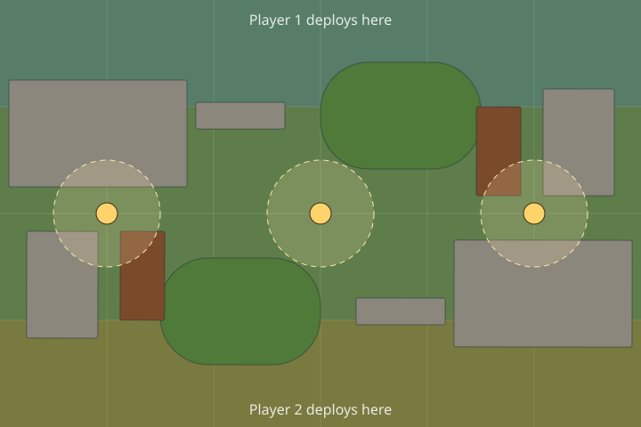

<!-- Made by `pnpm rulebook` from the rift-lanterns module (version 1.3.0). Don't edit by hand. -->

# Rift Lanterns: the rules

A small skirmish game for two players, about an hour long, played with three units a side. Lanterns have fallen into a rift, and four warbands go down after them.

## What you need

A table 36" x 24" (a kitchen table will do), a tape measure in inches, a handful of six-sided dice, and a warband each: your own models, or the stand-ins from the print-and-play sheets. Put some ruins, thickets and wrecks on the table: books and boxes work.

On a screen, Open Battle does the measuring and the dice. At a real table it can still keep the score: open it on a phone and pick **At a real table**.

## The turn

The game lasts **5 rounds**. In each round, players take turns activating one unit at a time, starting with the player who goes first, until every unit has gone. An activated unit:

1. **Moves** up to its Move in inches. Wrecks can't be walked through.
2. Then takes **one action**: **Shoot** or **Fight**. That ends its activation.
3. A unit that only moves ends its activation there.

When one player has no units left to activate, the other activates theirs in turn. The round ends when every unit has gone.

## Shooting

Pick an enemy unit that a shooter can see and that is within the shooter's Range. A unit locked in a fight (an enemy within 1") can't shoot.

- Each model rolls its **Shoot** dice. Each die that rolls the unit's **Hits on** number or higher (4+ means a 4, 5 or 6) is a hit; it needs **one more** (5+ for a 4+) if the target is in cover: when most of the target models the shooters can see are in or touching a ruin or thicket, or seen past one.
- The target rolls a die for each hit. Each die that rolls the target's **Saves on** number or higher saves that hit.
- Each hit not saved takes 1 wound. Models lose wounds in turn; a model with none left is out.

## Fighting

Pick an enemy unit within 1". The attackers roll their **Fight** dice and hit and wound as when shooting (no cover in a fight). Then, if any of the target are left, they strike back the same way.

## Holding a lantern

A side **holds** a lantern if it has more models within 3" of it than the other side. Nobody holds it on a tie. The side with more victory points at the end of round 5 wins.

## The warbands

Each warband is about 100 points, 3 units.

| Warband | Rule |
| --- | --- |
| **Wardens of the Wick**: shield-bearing lamp guards | **Shieldwall.** Saves against shooting succeed on one less. |
| **Thornkin**: hounds and walking briars | **Regrow.** At the start of each round, every wounded model heals 1 wound. |
| **Cogwright Guild**: gearmen, drones and a strider | **Overcharge.** When this unit shoots it may overcharge: 2 more dice, but each 1 rolled is a wound on the shooters. |
| **Gloam Choir**: robed singers and dusk stalkers | **Veiled.** Can't be shot from more than 12" away. |

| Unit | Warband | Models | Move | Shoot | Range | Fight | Hits on | Saves on | Wounds | Points |
| --- | --- | --- | --- | --- | --- | --- | --- | --- | --- | --- |
| Wick Guard | Wardens of the Wick | 5 | 5" | 1 | 18" | 1 | 4+ | 4+ | 1 | 50 |
| Lamplighters | Wardens of the Wick | 2 | 6" | 2 | 24" | 1 | 3+ | 5+ | 1 | 25 |
| Warden-Captain | Wardens of the Wick | 1 | 5" | 1 | 12" | 3 | 3+ | 3+ | 3 | 25 |
| Briar Hounds | Thornkin | 3 | 8" | – | – | 2 | 4+ | 6+ | 2 | 40 |
| Thorn Slingers | Thornkin | 4 | 6" | 1 | 12" | 1 | 4+ | 6+ | 1 | 35 |
| Old Bramble | Thornkin | 1 | 5" | – | – | 4 | 3+ | 4+ | 4 | 25 |
| Gearmen | Cogwright Guild | 4 | 5" | 1 | 24" | 1 | 4+ | 4+ | 1 | 40 |
| Spark Drones | Cogwright Guild | 2 | 8" | 2 | 12" | – | 4+ | 5+ | 1 | 25 |
| Strider | Cogwright Guild | 1 | 6" | 3 | 24" | 2 | 4+ | 3+ | 4 | 35 |
| Hushed Choir | Gloam Choir | 4 | 6" | 1 | 18" | 1 | 4+ | 5+ | 1 | 40 |
| Dusk Stalkers | Gloam Choir | 3 | 7" | – | – | 2 | 3+ | 5+ | 1 | 35 |
| Cantor of Ash | Gloam Choir | 1 | 6" | 2 | 18" | 1 | 3+ | 4+ | 3 | 25 |

## Missions

Both players deploy in a strip 6" deep along their long edge of a 36" x 24" table.

- **Lantern Grab.** Three lanterns lie across the middle of the rift. At the end of each round, each side scores 1 for each lantern it holds.
- **Snuff Them Out.** Break the enemy warband. One lantern in the middle: holding it at the end of a round scores 1. At the end of the game, each enemy unit wiped out scores 2.
- **The Last Lantern.** One lantern burns in the middle: from round 2, holding it at the end of a round scores 2. At the end of the game, each of your units with a model in the enemy's deployment strip scores 2.

## The starter table

- **Ruin**: cover.
- **Thicket**: cover; seen past it, a target is in cover.
- **Wreck**: can't be walked through; blocks sight.
- **Open ground**: no effect.

## Quick reference

- **5 rounds.** Take turns activating one unit each.
- **Activate:** move up to Move, then Shoot or Fight (or just move).
- **Shoot:** see it, in Range, no enemy within 1". Shoot dice; each at the Hits on number or higher hits (one more in cover).
- **Fight:** an enemy within 1". Fight dice; each at the Hits on number or higher hits; they strike back.
- **Saves:** a die per hit; each at the Saves on number or higher saves it. Each unsaved hit is a wound.
- **Lanterns:** most models within 3" holds it; a tie holds nothing.
